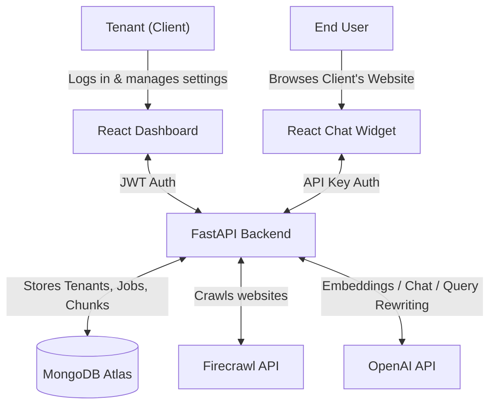
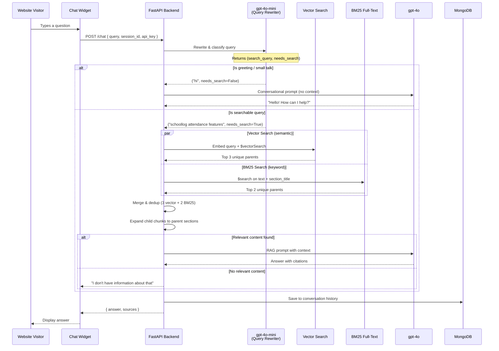
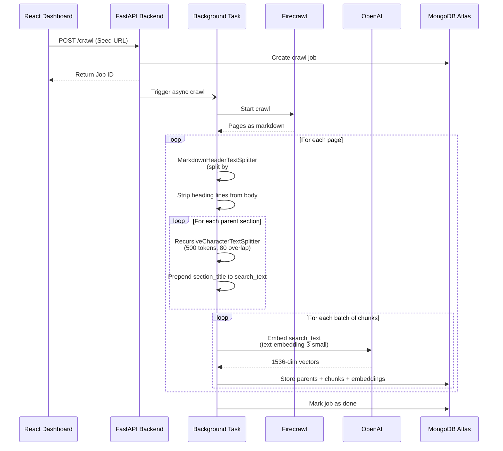
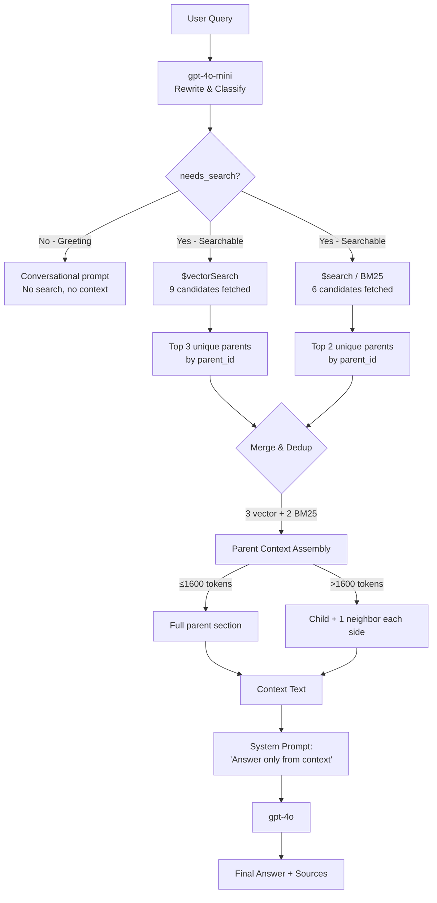
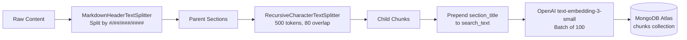

# AI Chatbot Widget SaaS

A multi-tenant SaaS platform where clients can sign up, crawl their websites, and embed an AI-powered chat widget.

## Architecture Overview

### 1. System Architecture


### 2. Chat Flow


### 3. Crawling & Indexing Flow


### 4. Hybrid Search Merge Strategy


## Prerequisites
- Docker & Docker Compose
- MongoDB Atlas cluster
- OpenAI API Key
- Firecrawl API Key

## 1. Setup Environment
Use `backend/.env.example` as the template:

```bash
cp backend/.env.example .env
```

For Docker Compose, keep the copied `.env` in the project root. For manual backend development, you can also copy it to `backend/.env` because the backend loads `.env` from its working directory.

Update the values:
```bash
MONGODB_URI=mongodb+srv://<username>:<password>@cluster0.mongodb.net/?retryWrites=true&w=majority
OPENAI_API_KEY=sk-proj-your-openai-api-key-here
FIRECRAWL_API_KEY=fc-your-firecrawl-api-key-here
JWT_SECRET=your-super-secret-jwt-key
ALLOWED_ORIGINS=http://localhost:3000,http://127.0.0.1:3000
VITE_API_BASE_URL=http://localhost:8000
```

`VITE_API_BASE_URL` is used when building the dashboard so browser requests and generated widget snippets point to the backend.

## 2. MongoDB Atlas Indexes

### Vector Search Index (`vector_index`)
Navigate to **Atlas Search** → **Create Search Index** → **Vector Search**.

- Database: `chatbot_db`, Collection: `chunks`
- Index Name: `vector_index`

```json
{
  "fields": [
    {
      "type": "vector",
      "path": "embedding",
      "numDimensions": 1536,
      "similarity": "cosine"
    },
    {
      "type": "filter",
      "path": "tenant_id"
    }
  ]
}
```

### Full-Text Search Index (`default`)
Navigate to **Atlas Search** → **Create Search Index** → **Atlas Search**.

- Database: `chatbot_db`, Collection: `chunks`
- Index Name: `default`

```json
{
  "mappings": {
    "dynamic": false,
    "fields": {
      "text": { "type": "string" },
      "section_title": { "type": "string" },
      "tenant_id": { "type": "string" }
    }
  }
}
```

The backend also creates regular MongoDB lookup indexes on startup for parent-child retrieval:
- `parents`: `tenant_id`, `parent_id`
- `chunks`: `tenant_id`, `parent_id`, `child_index`
- `pages`: `tenant_id`, `url`

## 3. Run the Platform

### Option A: Using Docker (Recommended)
Start the services using Docker Compose:
```bash
docker-compose up --build
```
This will:
- Build the widget bundle
- Start the FastAPI backend on `http://localhost:8000`
- Start the React Dashboard on `http://localhost:3000`

For deployed environments, set `VITE_API_BASE_URL` before building the dashboard so its API calls and generated widget snippet point at your backend URL.

### Option B: Without Docker (Manual Setup)
If you prefer running the services locally without Docker, you will need three separate terminal windows.

**Terminal 1: Build the Widget**
```bash
cd widget
npm install
npm run build
```

**Terminal 2: Start the Backend**
```bash
cd backend
cp .env.example .env
python3 -m venv .venv
source .venv/bin/activate  # On Windows: .venv\Scripts\activate
pip install -r requirements.txt
uvicorn main:app --reload --host 0.0.0.0 --port 8000
```
*(Note: If using `uv`, you can run `uv pip install -r requirements.txt` instead of regular pip).*

**Terminal 3: Start the Dashboard**
```bash
cd dashboard
npm install
export VITE_API_BASE_URL=http://localhost:8000
npm run dev
```

## 4. Usage
1. Open the Dashboard at `http://localhost:3000`.
2. Register a new tenant.
3. Go to Settings to copy your widget script tag.
4. Go to Crawl Jobs and start a crawl of your website (e.g., `https://example.com`).
5. Add the copied script tag to your site's HTML file.
6. Interact with the chat widget!

## Extra Knowledge Sources

Beyond website crawling, the platform supports **four types** of knowledge sources. All sources feed into the same unified vector + BM25 search index per tenant.

### Source Types

| Type | Input Method | Indexing Trigger |
|------|-------------|-----------------|
| **Website** | Seed URL → Firecrawl crawls pages | Automatic (during crawl) |
| **PDF** | File upload (`.pdf`) | Automatic (on upload) |
| **FAQ** | Manual Q&A pairs via dashboard | Explicit ("Index" button) |
| **Text Document** | Free-form text / markdown via dashboard | Explicit ("Index" button) |

### Ingestion Pipeline (Common to All Sources)

All source types pass through the same pipeline in `backend/services/ingestion.py`:



1. **Section Splitting** — Content is split by markdown headings (H1–H4) into parent sections using `MarkdownHeaderTextSplitter`. Sections under 8 tokens of body text are filtered. Unstructured content becomes a single parent.
2. **Chunk Splitting** — Each parent is split into child chunks of ~500 tokens with 80-token overlap via `RecursiveCharacterTextSplitter`. Tiny chunks (< 40 tokens) are merged into neighbors.
3. **Heading Prefix** — The section title is prepended to each child chunk's `search_text` field (used for embedding only), improving semantic retrieval. The clean `text` is served as LLM context.
4. **Embedding** — Chunks are embedded in batches of 100 via OpenAI `text-embedding-3-small` (1536 dimensions), with 3 retries and exponential backoff.
5. **Storage** — Each source produces three document types in MongoDB:
   - `pages` — One document per page/document with full raw content
   - `parents` — One document per markdown section
   - `chunks` — Child chunks with embeddings (the searchable unit)

### Source Lifecycle

#### Website Crawls
- Submitted via `POST /dashboard/crawl` with a seed URL.
- Background task calls Firecrawl API (up to 200 pages), ingests each page as markdown.
- Old chunks for re-crawled URLs are automatically cleaned up (dedup by `crawl_id`).

#### PDF Uploads
- Uploaded via `POST /dashboard/sources/pdf/upload`.
- Text is extracted page-by-page via PyMuPDF (`fitz`), formatted as `## Page N` markdown.
- A `sources` record is created with `status: "indexing"`, updated to `"ready"` on completion.

#### FAQs
1. Create a FAQ source container via `POST /dashboard/sources` (type: `faq`).
2. Add Q&A pairs via `POST /dashboard/sources/{source_id}/faqs`. Raw pairs stored in the `faqs` collection.
3. Click **"Index"** to trigger background ingestion — formats each as `Q: ...\nA: ...` and runs the pipeline.
4. Can re-index to pick up new or updated FAQs (clears existing indexed data first).

#### Text Documents
1. Create a text document source container via `POST /dashboard/sources` (type: `text`).
2. Add documents (title + body) via `POST /dashboard/sources/{source_id}/docs`.
3. Click **"Index"** to trigger background ingestion — same pattern as FAQs.

### Search-Time Behavior

- All indexed sources within a tenant are searched **together** as a single pool — there is no filtering by source type or source ID at query time.
- The hybrid search (3 vector + 2 BM25) retrieves the most relevant chunks regardless of which source type they came from.
- Sources can be deleted from the dashboard, which removes all associated chunks, parents, and pages.

## Rate Limiting & Abuse Protection

Three layers of rate limiting protect the chat endpoint:

| Layer | Scope | Limit | Mechanism | Purpose |
|-------|-------|-------|-----------|---------|
| **Per-IP** | Client IP address | 20 req/min | slowapi (`@limiter.limit`) | Catches individual bad actors bypassing session ID |
| **Per-tenant** | API key / tenant ID | 100 req/min | In-memory sliding window (`deque`) | All real users + attackers combined. Protects costs. |
| **Per-session** | `chat_session_id` cookie | 20 req/min | In-memory sliding window (`deque`) | Stops a single abusive user |
| **Max query length** | All requests | 500 chars | Rejected with 400 | Prevents token waste on huge inputs |

The per-IP and per-session limits catch individual bad actors. The per-tenant limit is the critical defense — since the API key is visible in the widget's script tag, a distributed attack using the same key from many IPs would bypass per-IP limits but is still blocked by the per-tenant sliding window.

In-memory counters reset on server restart. For production at scale, replace with Redis-backed rate limiting.

## Key Design Decisions

### Query Rewriting (LLM-based)
User questions are rewritten by **gpt-4o-mini** before vector search. A conversational question like *"what is schoollog and what it does"* is transformed into **"schoollog school management software features overview"** — aligning better with the declarative website content in the vector store. The same LLM call also classifies whether the input is a greeting (skip search) or a searchable query.

### Hybrid Search (Vector + BM25)
- **3 guaranteed slots** from vector search (semantic matching via `$vectorSearch`)
- **2 guaranteed slots** from BM25 full-text search (keyword matching via `$search`)
- Results are deduplicated by `parent_id`
- If BM25 doesn't fill its 2 slots, remaining slots are filled from vector results
- Both searches run in parallel via `asyncio.gather`

### Heading Prefix in Embeddings
Section titles (e.g., *"Bus Tracking"*) are prepended to child chunk text before embedding (stored as `search_text`). The body text alone (*"Track school buses in real-time"*) misses the most descriptive keywords. The prefix is only used for embedding — the clean `text` field is served to GPT as context.

### No Score Threshold
Vector similarity scores are not filtered — the top results are always taken. Query rewriting and hybrid search provide enough precision. Score thresholds were causing false negatives (returning nothing for valid queries).

### Empty Context Guard
If search returns zero results for a non-greeting query, the system returns *"I don't have information about that on this site"* immediately — without calling GPT-4o — preventing hallucination.

## Tech Stack

| Component | Technology |
|---|---|
| Backend | Python 3.12+, FastAPI, Uvicorn |
| Database | MongoDB Atlas (Motor async driver) |
| Embeddings | OpenAI `text-embedding-3-small` |
| Chat LLM | OpenAI `gpt-4o` |
| Query Rewriting | OpenAI `gpt-4o-mini` |
| Crawling | Firecrawl API |
| Auth | JWT (python-jose) + API keys (bcrypt) |
| Frontend (Dashboard) | React 18, Vite |
| Frontend (Widget) | React 18, Vite (embedded as script tag) |
| Chunking | LangChain (MarkdownHeaderTextSplitter + RecursiveCharacterTextSplitter) |
| Token Counting | tiktoken (`cl100k_base`) |
| Rate Limiting | slowapi |
| Containerization | Docker Compose |

## API Endpoints

| Method | Endpoint | Auth | Description |
|---|---|---|---|
| POST | `/chat` | API Key | Chat with the widget |
| POST | `/tenants/register` | None | Register a new tenant |
| POST | `/tenants/login` | None | Login |
| GET | `/tenants/stats` | JWT | Tenant stats |
| POST | `/tenants/rotate-key` | JWT | Rotate API key |
| POST | `/crawl` | JWT | Start a crawl job |
| GET | `/crawl/{job_id}` | JWT | Check crawl status |
| DELETE | `/index` | JWT | Delete indexed data |
| GET | `/dashboard/sources` | JWT | List all knowledge sources |
| POST | `/dashboard/sources` | JWT | Create a source container |
| GET | `/dashboard/sources/{source_id}` | JWT | Get source details + chunk count |
| DELETE | `/dashboard/sources/{source_id}` | JWT | Delete source + indexed data |
| POST | `/dashboard/sources/pdf/upload` | JWT | Upload and index a PDF |
| GET | `/dashboard/sources/{source_id}/faqs` | JWT | List FAQs in a source |
| POST | `/dashboard/sources/{source_id}/faqs` | JWT | Add a FAQ pair |
| PUT | `/dashboard/sources/{source_id}/faqs/{faq_id}` | JWT | Update a FAQ |
| DELETE | `/dashboard/sources/{source_id}/faqs/{faq_id}` | JWT | Delete a FAQ + its chunks |
| POST | `/dashboard/sources/{source_id}/faqs/index` | JWT | Index all FAQs for search |
| GET | `/dashboard/sources/{source_id}/docs` | JWT | List text documents in a source |
| POST | `/dashboard/sources/{source_id}/docs` | JWT | Create a text document |
| PUT | `/dashboard/sources/{source_id}/docs/{doc_id}` | JWT | Update a text document |
| DELETE | `/dashboard/sources/{source_id}/docs/{doc_id}` | JWT | Delete a text document + its chunks |
| POST | `/dashboard/sources/{source_id}/docs/index` | JWT | Index all text documents for search |
| POST | `/dashboard/crawl` | JWT | Start a crawl (dashboard) |
| GET | `/dashboard/crawl/{job_id}` | JWT | Check crawl status (dashboard) |
| DELETE | `/dashboard/index` | JWT | Delete indexed data (dashboard) |
