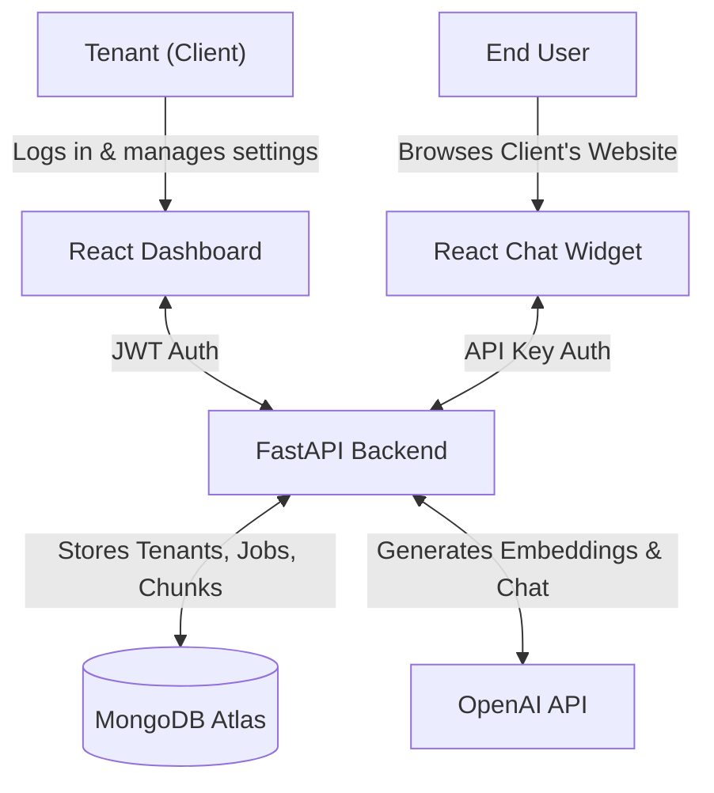
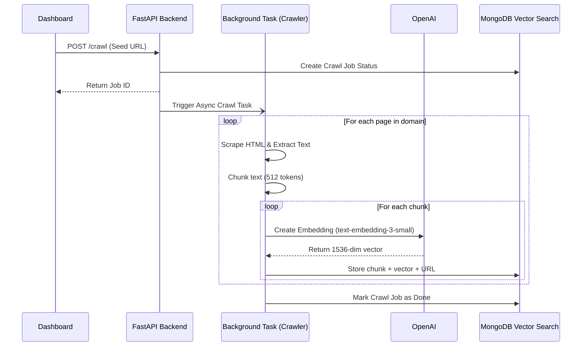
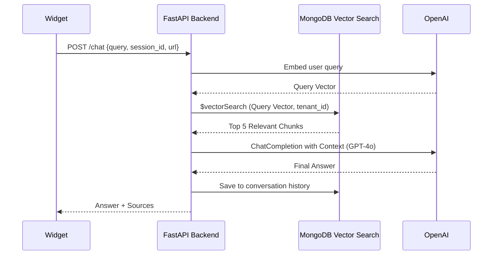

# AI Chatbot Widget SaaS

A multi-tenant SaaS platform where clients can sign up, crawl their websites, and embed an AI-powered chat widget.

## Architecture Overview

### 1. System Architecture


### 2. Crawling & Indexing Flow


### 3. Chat Request Flow


## Prerequisites
- Docker & Docker Compose
- MongoDB Atlas cluster
- OpenAI API Key
- Firecrawl API Key

## 1. Setup Environment
Create a `.env` file in the root directory (or export them):
```bash
MONGODB_URI=mongodb+srv://<user>:<password>@<cluster>.mongodb.net/?retryWrites=true&w=majority
OPENAI_API_KEY=sk-your-openai-api-key
FIRECRAWL_API_KEY=fc-your-firecrawl-api-key
JWT_SECRET=your-super-secret-jwt-key
ALLOWED_ORIGINS=*
VITE_API_BASE_URL=http://localhost:8000
```

## 2. MongoDB Atlas Vector Search Setup
1. Open MongoDB Atlas and navigate to your cluster.
2. Go to the "Atlas Search" tab and click "Create Search Index".
3. Select "JSON Editor".
4. Database: `chatbot_db`, Collection: `chunks`
5. Index Name: `vector_index`
6. Paste the JSON from `mongodb_index.json`:
```json
{
  "fields": [
    {
      "type": "vector",
      "path": "embedding",
      "numDimensions": 1536,
      "similarity": "cosine"
    },
    {
      "type": "filter",
      "path": "tenant_id"
    },
    {
      "type": "filter",
      "path": "url"
    }
  ]
}
```
7. Click "Next" and "Create Search Index".

## 3. Run the Platform

### Option A: Using Docker (Recommended)
Start the services using Docker Compose:
```bash
docker-compose up --build
```
This will:
- Build the widget bundle
- Start the FastAPI backend on `http://localhost:8000`
- Start the React Dashboard on `http://localhost:3000`

For deployed environments, set `VITE_API_BASE_URL` before building the dashboard so its API calls and generated widget snippet point at your backend URL.

### Option B: Without Docker (Manual Setup)
If you prefer running the services locally without Docker, you will need three separate terminal windows.

**Terminal 1: Build the Widget**
```bash
cd widget
npm install
npm run build
```

**Terminal 2: Start the Backend**
```bash
cd backend
python3 -m venv .venv
source .venv/bin/activate  # On Windows: .venv\Scripts\activate
pip install -r requirements.txt
uvicorn main:app --reload --host 0.0.0.0 --port 8000
```
*(Note: If using `uv`, you can run `uv pip install -r requirements.txt` instead of regular pip).*

**Terminal 3: Start the Dashboard**
```bash
cd dashboard
npm install
export VITE_API_BASE_URL=http://localhost:8000
npm run dev
```

## 4. Usage
1. Open the Dashboard at `http://localhost:3000`.
2. Register a new tenant.
3. Go to Settings to copy your widget script tag.
4. Go to Crawl Jobs and start a crawl of your website (e.g., `https://example.com`).
5. Add the copied script tag to your site's HTML file.
6. Interact with the chat widget!
