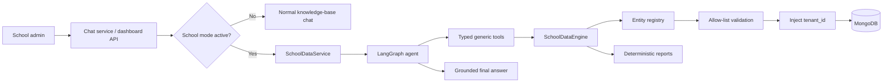
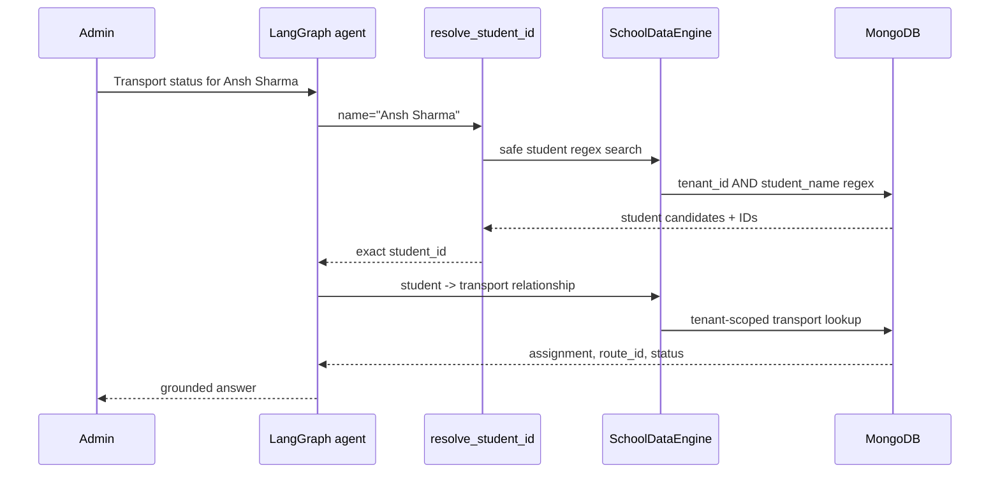
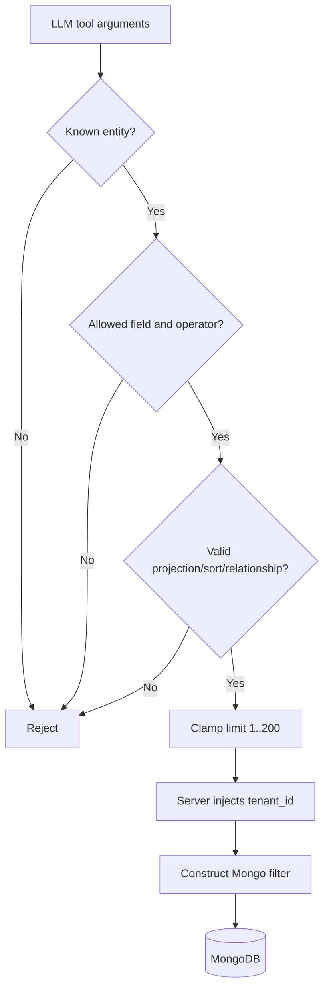
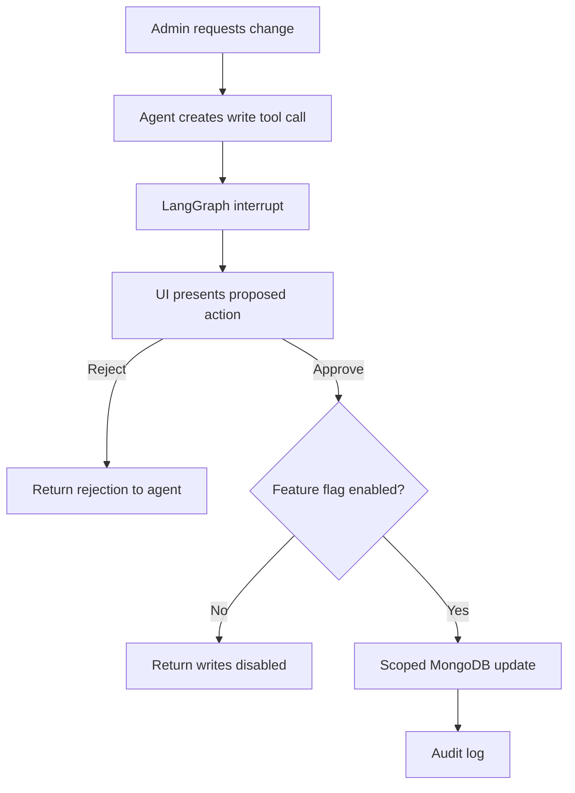
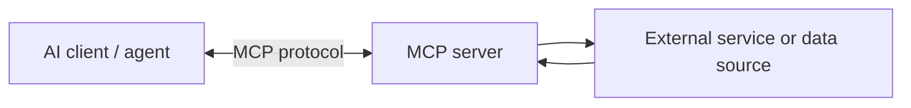

# School ERP Agent — Interview Preparation Guide

> **One-line pitch:** I built a tenant-safe School ERP agent where the LLM
> understands the question and chooses typed tools, but a deterministic backend
> owns authorization, query validation, financial calculations, writes, and
> auditability.

This is an interview guide for the School Module in this repository. It
explains what was built, why each choice was made, why common alternatives were
not used, how the design compares with current industry patterns, and what I
would improve before a larger production rollout.

---

## 1. The problem and the design goal

A school administrator should be able to ask natural-language questions such as:

- “Class 5 ke students dikhao.”
- “Ansh Sharma ki bus route aur status kya hai?”
- “Pure school ki outstanding fees aur student-wise amount batao.”
- “Change transport status to Inactive.”

The data is sensitive and tenant-scoped: students, addresses, fees, payments,
transport, hostel data, and staff data. Therefore the core problem is **not**
just converting language into MongoDB queries. The core problem is allowing
useful natural-language access without allowing the model to invent facts,
cross a tenant boundary, execute arbitrary database expressions, or silently
make an unsafe update.

### Design objectives

| Objective | How this implementation addresses it |
|---|---|
| Natural language UX | A LangGraph tool-calling agent plans multi-step lookups. |
| Tenant isolation | The server injects `tenant_id`; the model never receives it as a tool parameter. |
| Safe growth | A metadata registry supports new entities without a new LLM tool for every collection. |
| Accurate money | Deterministic reports calculate fee dues in Python, not in the LLM. |
| Safe mutations | Write tools require both a feature flag and a human approval interrupt. |
| Traceability | Every tool invocation is logged to query and audit collections. |
| Usable answers | Search results contain `total_count`, `returned_count`, and `has_more`. |

---

## 2. Architecture: explain it in 60 seconds



The runtime path is:

```text
chat_service.py / dashboard school endpoint
  -> SchoolDataService.query()
  -> school_agent/graph.py
  -> school_agent/tools.py
  -> SchoolDataEngine
  -> school_data_registry.py
  -> tenant-scoped MongoDB collections
```

### The key boundary to say clearly

> “The LLM is a planner and formatter, not a database authority. It can select
> from a narrow set of capabilities and propose structured arguments. The
> backend independently validates those arguments and constructs the actual
> database operation.”

That boundary is the most important design decision in the module.

---

## 3. Components and responsibilities

| Component | Responsibility | Why it exists |
|---|---|---|
| `SchoolDataService` | Builds agent state/config, invokes the graph, manages Redis school-mode TTL. | Keeps chat integration separate from ERP workflow logic. |
| `graph.py` | Agent node, tool routing, approval interrupt, conversation state. | Makes multi-step tool use and write approval explicit. |
| `tools.py` | Small public tool surface: reads, reports, resolvers, writes. | Gives the model only purposeful, typed operations. |
| `school_data_registry.py` | Entity/field/operator/projection/sort/relationship allow-list. | Turns schema governance into configuration. |
| `SchoolDataEngine` | Validation, tenant-scoped queries, relationships, report calculations. | Is the trusted execution layer. |
| MongoDB | Stores tenant-separated ERP records and audit records. | Source of truth. |
| Redis | Holds temporary School Mode state by session. | Lets normal chatbot sessions explicitly switch context. |
| Dashboard APIs | Provide live tenant-authenticated records and School Chat. | Lets an admin use the agent without widget credentials. |

### Agent state

The graph state contains `messages`, `tenant_id`, `school_session_id`, and
`original_question`. The configurable runtime also includes a `thread_id` and
the selected LLM provider/model. `thread_id` identifies a graph checkpoint
thread; it is **not** authorization. Tenant authorization comes from the
authenticated session and is supplied server-side.

---

## 4. How a question is answered

### Example: “What is Ansh Sharma’s transport status?”



The prompt directs the agent to use **resolve-then-query**: resolve a fuzzy
human name to an exact ID, then traverse an explicitly declared relationship.
This avoids the model guessing IDs or constructing fragile joins in prose.

### Example: “How many students are in UKG?”

1. `resolve_class_id(class_name="UKG")`
2. Read the returned `class_id`.
3. `count_school_entities(entity="student", filters=[...])`
4. Return the backend’s `total_count`.

For a count, the agent must use a count tool rather than count a truncated list.

---

## 5. Generic tools and the registry: the scalability decision

The agent has a small tool surface:

| Category | Tools |
|---|---|
| Generic reads | `search_school_entity`, `get_school_entity_detail`, `get_school_related_entities`, `count_school_entities`, `explain_school_schema` |
| Deterministic reports | `get_school_report` |
| Resolvers | `resolve_student_id`, `resolve_class_id` |
| Writes | `update_transport_status`, `update_hostel_status`, `update_fee_status` |

The current registry covers school, class, section, student, route, stop,
transport assignment, hostel assignment, applied fee, payment, and teacher.

### Why registry-driven generic tools?

- **Scalability:** adding a 200th table becomes a metadata change, not a new
  prompt/tool/function/test combination.
- **Security:** only registered fields, operators, sort keys, projections, and
  relationships can reach the database.
- **Consistency:** pagination and tenant filtering behave the same across
  entities.
- **Discoverability:** the agent can call `explain_school_schema` instead of
  relying solely on a huge static prompt.

### Why not one tool per table?

| One tool per collection | Registry-backed generic tools |
|---|---|
| Tool count grows linearly with schema size. | Tool count stays roughly constant. |
| LLM tool selection becomes harder and more error-prone. | Agent selects from a compact vocabulary. |
| Authorization and pagination code gets duplicated. | Shared engine enforces them once. |
| Easy to add inconsistent semantics. | Registry is a single governance point. |
| Can be clearer for a few highly bespoke operations. | Best for standard search/detail/relationship operations. |

**Nuance for an interviewer:** generic tools are not a reason to force every
business action into generic CRUD. A business-critical calculation or a
workflow with domain invariants deserves a dedicated deterministic report or
command.

### What the registry allows

An `EntitySpec` declares collection, primary key, safe fields, default
projection, sortable fields, and relationships. A `FieldSpec` declares type,
allowed operators and flags. A `RelationshipSpec` declares the only supported
cross-entity link.

```python
"student": EntitySpec(
    collection="school_students",
    primary_key="student_id",
    fields={
        "student_name": FieldSpec("string", ("$eq", "$regex", "$in")),
        "class_id": FieldSpec("number", ("$eq", "$in")),
    },
    relationships={
        "fees": RelationshipSpec("applied_fee", "student_id", "student_id"),
        "transport": RelationshipSpec("transport_assignment", "student_id", "student_id"),
    },
)
```

---

## 6. Query safety: what actually protects data



### Enforcement details

- The `tenant_id` filter is constructed by `SchoolDataEngine`, from trusted
  runtime configuration. It is not present in the model-facing schema.
- The allow-listed operators are `$eq`, `$regex`, `$in`, `$ne`, `$gt`, `$gte`,
  `$lt`, and `$lte`; dangerous MongoDB operators such as `$where`, `$expr`,
  `$function`, and `$accumulator` are rejected.
- An attempted filter on `tenant_id` is rejected, so a model cannot override
  the injected boundary.
- Projections and sorts are validated against the registered entity; `_id` is
  excluded from generic results.
- Regex input is capped at 200 characters. In the dashboard’s student search,
  user input is also escaped before it becomes a regex.
- Generic reads are limited to a maximum of 200 rows and return `has_more`.
- Unknown entities, fields, operators, and relationships fail closed with an
  error instead of being ignored.

### Registry safety layer — beginner walkthrough

Think of MongoDB as a set of named boxes called **collections**. A collection
contains JSON-like records called **documents**. For example,
`school_students` is a collection and one student is a document:

```json
{
  "tenant_id": "tenant_abc",
  "student_id": 42,
  "student_name": "Ansh Sharma",
  "class_id": 5,
  "section_id": 2
}
```

The registry is a **backend-controlled permission sheet**. It says which box
an agent can open, which labels inside the box it may use, and which kinds of
questions it may ask. The LLM never gets direct MongoDB access.

#### One real request, step by step

For “Show students in class 5,” the model may propose this *tool input*:

```json
{
  "entity": "student",
  "filters": [
    {"field": "class_id", "op": "$eq", "value": 5}
  ],
  "projection": ["student_id", "student_name", "admission_no"],
  "sort": [{"field": "student_name", "direction": "asc"}],
  "limit": 50
}
```

It is only a request, not a MongoDB command. The engine processes it as follows:

| Step | Code concept | What it checks / produces |
|---|---|---|
| 1 | `get_entity_spec("student")` | Finds the `student` rule in `SCHOOL_ENTITY_REGISTRY`; this maps to `school_students`. Unknown names fail. |
| 2 | `validate_filter_condition(...)` | Confirms `class_id` is an allowed student field and `$eq` is allowed for it. |
| 3 | `validate_projection(...)` | Confirms every requested return field is safe. The database’s internal `_id` is excluded. |
| 4 | `build_sort(...)` | Confirms `student_name` was deliberately marked sortable. |
| 5 | `normalize_limit(50)` | Keeps the value between 1 and 200. A request for 10,000 becomes 200. |
| 6 | `build_entity_filter(...)` | Adds the trusted session tenant, producing the real filter below. |
| 7 | `find(...)` | Runs the constructed, restricted read against MongoDB. |

The engine—not the LLM—creates this actual MongoDB filter:

```python
{
    "$and": [
        {"tenant_id": "tenant_abc"},
        {"class_id": {"$eq": 5}}
    ]
}
```

`$and` means **both conditions must be true**. Therefore, MongoDB will return
only class-5 records that also belong to `tenant_abc`. Even if another tenant
has a student with the same ID or name, it cannot appear in this result.

#### Examples of requests the layer refuses

| Unsafe model request | Why it is refused |
|---|---|
| `{"entity": "users"}` | `users` is not a registered ERP entity. |
| Filter on `password_hash`, `api_key`, or `tenant_id` | These fields are not in the entity allow-list; `tenant_id` must come from the server. |
| `{"op": "$where", "value": "...JavaScript..."}` | `$where` can execute server-side JavaScript and is not in `SAFE_OPERATORS`. |
| Sort by `father_name` | A field can be readable but not sortable; only explicitly sortable fields are allowed. |
| Ask for `limit: 100000` | The engine clamps a generic list to 200. |
| Student → `bank_account` relationship | Only relationships declared in the registry may be traversed. |

This is called **allow-list security**: reject everything by default, then
explicitly allow the minimum safe capabilities. It is much safer than trying
to maintain a growing blacklist of dangerous MongoDB features.

### MongoDB operations used here, in plain English

MongoDB documents are similar to Python dictionaries / JSON objects. The
project uses Motor, an asynchronous Python driver, so `await` means “start the
database operation and let the server handle other work while it waits.”

| Operation | Plain-English meaning | Example in this module |
|---|---|---|
| `find(filter, projection)` | Find every matching document, returning a cursor (a lazy result stream). | Find students for the tenant and class. |
| `find_one(filter, projection)` | Find at most one matching document. | Dashboard gets one student by `tenant_id` + `student_id`. |
| `count_documents(filter)` | Count matching documents without fetching all of them. | Count students in UKG. |
| `cursor.sort(...)` | Order the cursor results. `1` is ascending; `-1` is descending. | Students sorted by ID or name. |
| `cursor.limit(n)` | Return at most `n` rows. | Prevent an unbounded chat response. |
| `cursor.to_list(length=n)` | Materialize up to `n` cursor results as a Python list. | Turn a limited Mongo result into tool JSON. |
| `insert_one(document)` | Create one document. | Write an audit-log record. |
| `update_one(filter, update)` | Change the first document matching a filter. | Change a tenant-scoped transport/hostel/fee status after approval. |
| `delete_many(filter)` | Delete every matching document. | Used by test cleanup only, never by the agent’s public tools. |

#### MongoDB filter operators used by the registry

| Operator | Meaning | Student example |
|---|---|---|
| `$eq` | equals | `{"class_id": {"$eq": 5}}` |
| `$in` | equals any value in a list | `{"class_id": {"$in": [5, 6]}}` |
| `$ne` | does not equal | `{"gender": {"$ne": "Unknown"}}` |
| `$gt`, `$gte` | greater than / greater than or equal | `{"amount": {"$gte": 1000}}` |
| `$lt`, `$lte` | less than / less than or equal | `{"amount": {"$lt": 5000}}` |
| `$regex` | text-pattern match | `{"student_name": {"$regex": "ansh", "$options": "i"}}` (`i` = case-insensitive) |
| `$and` | all conditions must match | tenant filter **and** class filter. |

The engine permits only the first seven operators through `SAFE_OPERATORS`;
`$and` is generated by backend code only. The LLM cannot submit a free-form
Mongo filter such as `$where` or an aggregation pipeline.

#### Projection, sort, and update syntax

**Projection** controls fields returned, not which records match:

```python
db.school_students.find(
    {"tenant_id": "tenant_abc"},
    {"_id": 0, "student_id": 1, "student_name": 1}
)
```

This means: find this tenant’s students, but show only `student_id` and
`student_name`; hide MongoDB’s default `_id` field.

**Sort and limit** make a list predictable and bounded:

```python
cursor = db.school_students.find({"tenant_id": "tenant_abc"})
rows = await cursor.sort([("student_name", 1)]).limit(50).to_list(length=50)
```

**Update** has two distinct objects: a matching filter and a change operation:

```python
await db.school_transport_assign.update_one(
    {"tenant_id": "tenant_abc", "transport_id": 300},
    {"$set": {"transport_status": "Inactive"}},
)
```

The first object says *which exact record may change*. The second says *what
field to change*. The tenant condition must remain in the first object. In this
project, this operation occurs only after the graph approval interrupt and the
write feature-flag check.

### Why prompt instructions are not enough

Prompts are helpful UX policy, but an LLM can be confused, jailbroken, or
simply make a mistake. A prompt saying “always filter by tenant” is not a
security control. Server-side authorization and a strict allow-list are. This
matches the least-privilege direction recommended for LLM systems exposed to
prompt-injection and excessive-agency risks by the
[OWASP LLM Top 10 (2025)](https://owasp.org/www-project-top-10-for-large-language-model-applications/assets/PDF/OWASP-Top-10-for-LLMs-v2025.pdf).

### Why not allow raw MongoDB or “NL to Mongo”?

| Raw LLM-generated Mongo query | This implementation |
|---|---|
| Model can propose arbitrary fields, operators, aggregation stages, and collection names. | Model chooses typed arguments within an allow-list. |
| Hard to prove tenant filter cannot be omitted or altered. | Server always injects tenant filter. |
| Prompt injection may turn into data exfiltration or expensive queries. | Query expressiveness is deliberately constrained. |
| Flexible for prototypes and analysts. | Safer for a multi-tenant operational ERP. |

Raw NL-to-SQL/Mongo approaches can be acceptable in a tightly isolated,
read-only analytics sandbox over a curated semantic model. They are a poor
default for operational student data and production writes.

---

## 7. Financial correctness: why deterministic reports exist

The agent does **not** calculate dues by reading a limited fee list and doing
math in its final response. It calls:

```text
get_school_report(report_id="due_fees_by_student")
```

The engine computes, for each applied fee:

```text
due_amount = max(amount - concession - payments_for_the_same_applied_fee, 0)
```

It then groups due amounts by student and fetches the matching tenant-scoped
student details. By default, only `Pending` and `Partial` fee records are
included. The response returns both the school-level `total_due` and the
student-wise rows from this *same calculation path*.

### Why this matters

The earlier failure mode was: one request asked for total dues, another asked
for a student list, low-level calls returned limited/incomplete rows, and the
LLM tried to reconcile them. This can produce two plausible but inconsistent
answers. A single authoritative report removes that mismatch.

### Why not let the LLM calculate financial totals?

- It may omit pages of results, double-count, mishandle Decimal values, or use
  a different formula in a follow-up question.
- Finance requires repeatability, testability, and a clear calculation basis.
- The LLM should explain a result; code should calculate it.

### Why not use a Mongo aggregation pipeline for every report?

Mongo aggregation is often a good production choice for large data volumes,
especially when grouped operations can run close to data. This implementation
uses explicit Python logic because the current report is modest, transparent,
and easy to unit-test with `Decimal`/`Decimal128` normalization. At larger
scale, I would benchmark an indexed aggregation pipeline or a materialized
reporting model, while keeping the same deterministic API contract.

---

## 8. Writes: human approval and defense in depth



For a write action, the graph routes to an approval node before the write tool
is executed. `interrupt()` pauses the graph and returns an approval payload.
Only a later resume with `{"approved": true}` allows the write tool to run.
The write tools also check `SCHOOL_WRITE_ACTIONS_ENABLED`, which defaults to
false. Every update filter includes the trusted tenant ID.

### Why both approval and a feature flag?

They control different risks:

- **Approval** is per action: did an authorized human review this exact change?
- **Feature flag** is operational: can this deployment perform ERP writes at
  all? It is a fast rollback/kill switch.

Two independent controls are valuable for high-impact records.

### Why not ask the model to confirm in chat?

Model text such as “Are you sure?” is not an authorization boundary. The model
could skip it, misinterpret a reply, or be manipulated by instructions in the
conversation. The approval interrupt creates a server-controlled pause and a
separate explicit resume path.

### Why not enable autonomous writes?

For low-risk, reversible actions, automatic execution can reduce friction. For
student, transport, hostel, and fee records, the blast radius is higher. The
current design favors correctness and accountable approval over speed. A later
policy could auto-approve narrowly scoped, idempotent actions for a role with
explicit permission, but that needs a separate authorization and risk model.

---

## 9. Auditability, observability, and answer limits

Each tool invocation is logged to `school_data_query_log` and
`school_audit_log`, including tenant, session, question (capped at 500 chars),
tool name, generated filter, and timestamp. This provides:

- incident investigation: which tool and filters were used;
- compliance evidence: which tenant/session accessed a record;
- quality analysis: which questions cause tool errors or bad plans;
- operational debugging: trace a response back to source facts.

The current code catches audit-log failures so an audit outage does not break a
user request. That is an availability trade-off. For regulated production data,
I would make write audit logging durable/transactional or send it to a reliable
event/outbox pipeline and alert on failures.

Every generic list result includes `total_count`, `returned_count`, `limit`,
and `has_more`. The system prompt requires the agent to disclose truncation.
This prevents the common deceptive answer “these are all students” when the
backend intentionally returned the first 50 or 200.

---

## 10. Comparison with current industry patterns

There is no single industry-standard agent architecture. Mature systems usually
combine structured tool calling, deterministic domain services, policy
enforcement, observability, and human review for consequential actions. This
module follows that direction.

| Pattern seen in industry | Where this module aligns | Difference / next step |
|---|---|---|
| Tool/function-calling agents | Uses typed LangChain tools; LLM plans, backend executes. | Add strict JSON-schema validation at the API/tool boundary and tool-call evaluation metrics. |
| Stateful agent graphs | Uses LangGraph nodes, conditional routing, and interrupts. | Replace `MemorySaver` with durable checkpoint storage before relying on approvals across process restarts. |
| Semantic layer / governed data access | Registry is a lightweight domain semantic layer: entities, fields, relationships, reports. | Add data classification, RBAC/ABAC policies, schema versioning, and owner approval for registry changes. |
| Read vs. write separation | Uses generic read tools and explicit write tools with HITL. | Add role/permission checks per command, idempotency keys, and optimistic concurrency. |
| Deterministic business logic | Due-fee report is backend-calculated. | Build a report catalog and reconciliation/evaluation suite for every financial KPI. |
| Agent tracing and evaluation | Stores audit records and has unit tests. | Add distributed traces, prompt/model versions, tool latency/error dashboards, replay datasets, and regression evals. |
| Retrieval augmented generation (RAG) | Normal chatbot mode uses RAG; ERP mode uses live tools. | Keep these sources explicitly separated and label whether an answer comes from policy docs or live ERP data. |

### A useful distinction: RAG versus tool use

| RAG | School ERP live-data tools |
|---|---|
| Best for unstructured, relatively stable knowledge: handbook, FAQs, policies. | Best for current, structured records: fee status, attendance, transport assignment. |
| Retrieves text chunks by semantic relevance. | Executes validated queries/reports against the system of record. |
| Answers can cite retrieved documents. | Answers are grounded in live, tenant-scoped facts. |
| Weak for exact totals and mutations. | Designed for exact counts, deterministic totals, and controlled writes. |

An interview-quality answer is: “I did not use RAG as a database. RAG remains
useful for school policy questions, while the ERP agent uses tools for live
operational facts.”

### Why LangGraph instead of a single LLM call?

| Single-shot tool call | LangGraph workflow |
|---|---|
| Fine for one simple lookup. | Supports resolve → query → related query → answer loops. |
| Harder to pause/resume a risky action safely. | Native interrupt/resume model for human approval. |
| Less explicit control flow and state. | Nodes and edges make routing reviewable/testable. |
| Lower framework overhead. | More suitable when workflows grow beyond one step. |

LangGraph’s current documentation explicitly describes interrupts as a way to
pause an agent, persist state through a checkpointer, and resume with a
`Command`; it also recommends a durable checkpointer in production.
[LangGraph interrupt documentation](https://langchain-ai.github.io/langgraph/how-tos/human_in_the_loop/breakpoints/)

---

## 11. What is MCP, and why is it not used for the School ERP agent?

**MCP (Model Context Protocol)** is an open protocol for connecting an AI
application (the *client*) to a tool/data provider (the *MCP server*) through a
standard interface. In simple terms, it is like a common plug shape: instead of
building a custom integration for every AI client and every external service,
an MCP server can publish its tools/resources in a reusable format.



For example, a company could expose a controlled `search_customers` tool from
an MCP server. Multiple compatible clients could discover and call that tool
without each client implementing its own connector. OpenAI supports remote MCP
servers as a tool option in the Responses API; OpenAI also warns that remote
MCP servers are third-party services and that data sent to them follows their
own retention and residency policies.
[OpenAI API data controls](https://platform.openai.com/docs/models/default-usage-policies-by-endpoint)

### MCP compared with this project’s local tools

| MCP | Current School ERP tools |
|---|---|
| A protocol for communicating with a separate tool server. | Python functions running inside this backend process. |
| Useful to make capabilities reusable across multiple clients/products. | Optimized for one application’s security model and domain rules. |
| Requires transport, server authentication, authorization, discovery, versioning, and network reliability. | Uses direct typed function calls, so no internal network hop. |
| Can expose an existing system to approved external AI clients. | Keeps student data and safety logic inside the application boundary. |
| Does not itself make a database query safe. | The registry/engine directly enforce query and tenant safety. |

### Why MCP is not used here

MCP would solve a **different** problem from the registry. This application
already owns the School ERP database, the FastAPI backend, the agent graph, and
the tenant authentication flow. Calling local functions is the simplest and
lowest-latency option. More importantly, the important controls are local:

- `SchoolDataEngine` injects the authenticated tenant ID.
- The registry allow-lists fields, operators, projections, relationships, and
  limits before MongoDB is called.
- Deterministic reports own financial calculations.
- Write actions use an approval interrupt, feature flag, and tenant-scoped
  update filter.

Putting these functions behind an MCP server would not remove any of those
controls. It would add another service boundary that must be secured and
operated. For a single backend and one database, that is additional complexity
without a clear product benefit.

> **Interview answer:** “We did not use MCP because MCP standardizes *how a
> client talks to an external tool server*; it is not a replacement for domain
> authorization or query safety. The ERP tools are internal, latency-sensitive,
> and tightly coupled to tenant context, so direct in-process tools plus the
> registry are simpler. We would introduce MCP when other approved clients or
> products genuinely need the same governed ERP capabilities.”

### When MCP would be a good next step

MCP becomes useful if the school wants to expose the same safe **business
capabilities** to more than this chatbot, for example a staff Copilot, an
internal analytics assistant, a support tool, or an approved partner product.
The MCP server should expose high-level operations such as
`get_student_transport_status` or `due_fees_by_student`, not raw MongoDB or a
generic unrestricted query endpoint.

Even then, the architecture should be:

```text
MCP client -> authenticated MCP server -> SchoolDataEngine/Reports -> MongoDB
```

The MCP server must derive the caller identity and tenant from verified
credentials, invoke the same registry and authorization policy, apply rate
limits/audit logging, and never trust a caller-provided tenant ID. MCP is a
transport/interoperability layer; the registry remains the enforcement layer.

---

## 12. Important limitations and production improvements

Be candid in an interview. A strong engineer knows what is implemented and
what must change at scale.

| Current state | Risk | Production improvement |
|---|---|---|
| `MemorySaver` checkpointer in `graph.py` | Pending approvals and graph state disappear on process restart and do not scale across replicas. | Use Redis/Postgres/Mongo-backed durable checkpoints; partition by tenant and retain state securely. |
| All authenticated school users share the same functional capability | A user may have more access than their job requires. | Add RBAC/ABAC: principal, role, school, class, and action scopes enforced in the engine—not only in prompts. |
| Simple `update_one` write commands | Lost update or stale decision is possible if a record changes before approval. | Include record version/`updated_at`, validate expected version on write, use idempotency keys and an approval expiry. |
| Audit insertion is best-effort | Audit gaps are possible during DB failures. | Use a transactional outbox or durable event pipeline; alert and reconcile failures. |
| Generic regex search | Broad or poorly indexed searches can be slow and ambiguous. | Use indexes, escaped/prefix search where possible, result disambiguation UX, and rate/query-cost limits. |
| List limit is 200 | Large exports cannot be safely represented in a chat response. | Provide asynchronous, authorized export/report jobs with signed download links and audit records. |
| Current due report reads relevant rows into application memory | Can become expensive for very large tenants. | Benchmark and move aggregation to MongoDB/warehouse; cache only with safe invalidation. |
| Tool result is converted to a string for the LLM | Weaker type guarantees and possible large prompt payloads. | Use structured tool responses, compact result views, response schemas, and token-budget limits. |
| One graph route treats a tool-call message containing any write as approval work | Mixed read/write calls should have explicit sequencing semantics. | Validate one command per action or split reads, approval, and writes into a formal command plan. |
| Prompt carries some schema/process instructions | Prompt can grow as the ERP grows. | Retrieve compact schema capability cards or use deterministic routing for common intents. |

### What I would prioritize next

1. Durable checkpointer plus a real approval UI/resume endpoint.
2. Per-user RBAC/ABAC and a command authorization policy in the engine.
3. Optimistic concurrency, idempotency, and immutable write audit events.
4. Index review, query cost budgets, rate limits, and large-report export jobs.
5. Golden-question regression tests, adversarial prompt-injection tests, and
   metrics for accuracy, tool failure, latency, and user correction rate.

---

## 13. Testing evidence

Existing tests cover:

- unknown entity rejection;
- sensitive/unknown field rejection, including `tenant_id`;
- dangerous operator rejection (`$where`, `$expr`, `$function`, etc.);
- regex length guard;
- server-side tenant filter injection;
- resolver behavior;
- multi-hop student-to-transport lookup;
- write interruption, approval resume, and successful update;
- dual audit-log writes;
- due-fee arithmetic and query-limit metadata in the data-engine tests.

Run them with:

```bash
PYTHONPATH=backend uv run python -m unittest discover -s backend/tests -p "test_*.py" -v
```

For production, add integration tests against a Mongo environment with schema
validators and indexes, authorization matrix tests, load tests, failure tests
for checkpoints/audits, and LLM evaluation tests that assert correct tool use
rather than only final text.

---

## 14. Interview questions and strong answers

### “Why did you not generate Mongo queries directly from the prompt?”

“Because Mongo syntax is an execution language, not a safe trust boundary. A
prompt cannot guarantee tenant scoping or prevent a malicious operator. I
restricted the model to typed capabilities and validated every entity, field,
operator, projection, sort, relationship, and limit on the server. The server
injects tenant context, so it cannot be overridden by the model.”

### “How does this scale when the ERP has 200 tables?”

“I separated generic data-access capabilities from entity metadata. New tables
usually require an `EntitySpec` with safe fields, default projections, and
relationships; the same generic tools continue to work. I only add a dedicated
tool/report when the operation has distinct business semantics, such as a
financial calculation or a workflow command.”

### “How do you stop hallucinated totals?”

“The agent is instructed not to calculate totals from lists. For due fees it
calls a deterministic report which matches payments to applied fee IDs, applies
concessions, floors each fee at zero, groups by student, and returns both total
and rows from the same calculation. The model explains that result rather than
creating it.”

### “Why use an agent graph at all?”

“Some questions need multiple dependent steps: resolve a name, follow a
relationship, then fetch a related route. A state graph makes that loop,
conditional routing, and approval interruptions explicit. A simple single-call
chain would be enough only for straightforward reads.”

### “How are writes safe?”

“A write tool call routes to a LangGraph interrupt before execution. A human
must explicitly resume with approval, and a separate feature flag must be on.
The update itself filters by server-derived tenant ID and is logged. In the
next iteration I would add user-level authorization, version checks, and
idempotency keys.”

### “What happens if a student name matches multiple people?”

“The resolver returns candidates with IDs and admission/class/section context.
The agent should disambiguate rather than guess. This is safer than assuming a
name is unique, especially in a school.”

### “What is the difference between School Mode and the normal chatbot?”

“Normal mode is a RAG assistant for indexed website knowledge. School Mode is
a live ERP tool agent, enabled per Redis-backed session. The sources and trust
models are different: RAG retrieves documents; the ERP agent executes
validated tenant-scoped operations.”

### “What is your biggest current production concern?”

“The graph currently uses an in-memory checkpointer. That is appropriate for
development/tests but not durable approval workflows across restarts or
multiple instances. I would make checkpoint persistence and authorization the
first production hardening work.”

---

## 15. Practical extension checklist

### Add a standard new table

1. Add an `EntitySpec` to `SCHOOL_ENTITY_REGISTRY`.
2. Expose only non-sensitive fields required by the use cases.
3. Choose each operator deliberately; do not default to regex or range search.
4. Set a minimal default projection and safe sortable fields.
5. Declare only valid relationships.
6. Ensure `tenant_id` exists in the collection and index the expected access
   paths.
7. Add registry/tenant-isolation tests and a tool-use evaluation example.

### Add a business-critical report

1. Define the business formula with finance/domain owners.
2. Implement it deterministically in the engine or a reporting service.
3. Return formula/version, filters, totals, row counts, and pagination metadata.
4. Test edge cases: partial payment, concession, overpayment, missing links,
   and tenant isolation.
5. Do not ask the LLM to recreate the calculation.

### Add a write command

1. Create a narrow, typed command—not a generic “update any field” tool.
2. Enforce authorization in backend code.
3. Validate state transition and required fields.
4. Show a human-readable diff in the approval UI.
5. Use tenant scope, idempotency, optimistic locking, and immutable audit log.
6. Test approval, rejection, retry, concurrent modification, and rollback.

---

## 16. Final takeaway

The School ERP Agent is intentionally a **governed tool-use system**, not an
autonomous database chatbot. The LLM contributes language understanding,
multi-step planning, and clear answers. Deterministic backend services retain
control over security, data access, calculations, writes, and evidence. That
division of responsibility is what makes the design appropriate for a
multi-tenant, operational school ERP.
